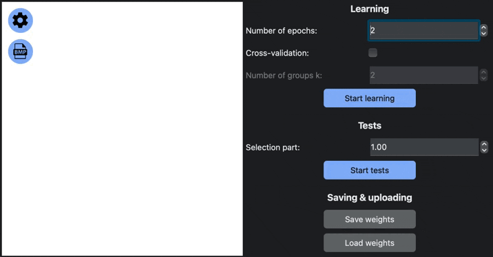

# MLP

Application that allows you to learn and use Multilayer Perceptron to classify hand-writed letters.
    
## BASIC APP FUNCTIONS:

- Drawing area, where you can scratch anything you want and MLP will try to predict the letter you wrote
- Uploading image from bmp-file (up to 512x512 pixels)
- MLP setting window
- Learning section, where you can try to learn your own MLP
- Tests section, where you may test your MLP
- Saving & uploading section. Here you can save your MLP learn progress to local file

### EXAMPLE:

### HOW TO USE:

- First, when you start a program, MLP is unlearned. You need to configure and press
    "START LEARNING" or load weights from local file that was made earlier.
- Then you can scratch anything on drawing area or load image from bmp-file and see how MLP is
    trying to predict a letter.
- You can test your MLP by choosing a selection part of tests number and click "START TESTS".
- If you need something different, you can try to configure your MLP in "Setting" window by
    pressing button with shaft button.

### RECOMENDATION:

- Don't choose more than 2 number of epochs or groups k, because you'll need a lot of time to wait.
- Don't use large bmp-files. Up to 512x512 pixels.
- Draw letters in center and almost at full size of area.

### SETTINGS:

- Realization of MLP: Matrix or Graph
- Count of hidden layers: from 2 to 5

